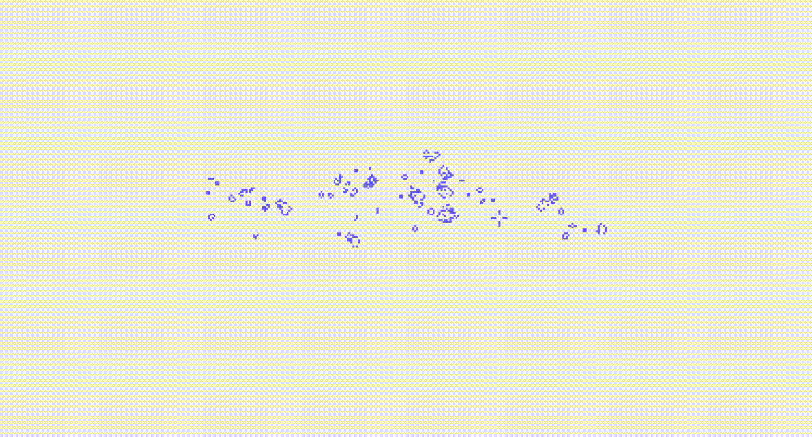

# Game of Life in Processing



## Description
My implementation of Game of Life in Processing.

## Requirements
[Processing](https://processing.org) is required.

## Quick Start
### Windows
*(may work on Linux too but wasn't tested)*
```console
$ processing-java --sketch=path/to/gol --run
```
**Note:** `path/to/gol` is a path to the directory containing `gol.pde`

## How to play
The game starts in draw mode in which you can draw cells using mouse.

Press `D` to start the simulation. Press `D` again to switch back to the draw mode.

Press `C` at any time to clean the screen.
